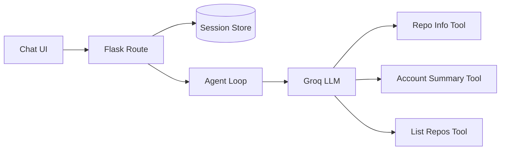

# GitSpy 

An AI agent that answers natural-language questions about GitHub accounts and repositories using LLM function-calling — built to learn how AI agents actually work under the hood.

## What it does

Ask GitSpy things like:
- "Give me a summary of Vrishali's GitHub account"
- "How many stars does repo has?"
- "List all repos for a user"

The LLM decides which GitHub API calls to make, executes them, and responds in natural language — with full conversation memory, so you can ask follow-up questions.

**Example conversation:**
You: Give me a summary of torvalds' GitHub account
🤖 GitSpy: Linus Torvalds – GitHub Profile Summary

Followers: 309,408
Public repositories: 12
Total stars across all repos: 250,493
Top repository: linux (237,895 stars)
Most used language: C


## How it works

1. User asks a question in plain English
2. The LLM (via Groq) decides whether it needs a tool, and which one
3. Python executes the real GitHub API call
4. Results are fed back to the LLM
5. The LLM writes a natural-language answer using the real data

This loop (think → act → observe → respond) is the core pattern behind every AI agent, regardless of framework.

## Architecture

GitSpy is a conversational agent that answers questions about GitHub 
repos and accounts. It uses an LLM (Groq, gpt-oss-20b) with function-calling 
to decide which GitHub API calls to make, executes them, and loops until 
it has enough information to respond.



The user's question flows through Flask into the agent loop, which calls 
Groq's LLM. The LLM decides whether to answer directly or call one of the 
three GitHub tools — if it calls a tool, the result gets fed back into the 
loop so the model can reason over it (up to 5 rounds, to prevent infinite 
looping on ambiguous questions).
## Tech stack

- **Python** — core logic
- **Groq API** (`openai/gpt-oss-20b`) — LLM with function-calling/tool-use
- **GitHub REST API** — live repo/account data
- **Flask** — web backend with session-based conversation memory
- **HTML/CSS** — chat interface frontend

## Tools implemented

| Tool | What it does |
|---|---|
| `get_repo_info` | Fetch stars, issues, language, and last update for a specific repo |
| `get_account_summary` | Aggregate stats across a user's account: total stars, top repo, most-used language |
| `list_user_repos` | List all public repos for a user, sorted by stars |

## Setup

1. Clone this repo:
```bash
   git clone https://github.com/Vrishali34/gitspy.git
   cd gitspy
```

2. Create a virtual environment and install dependencies:
```bash
   python3 -m venv venv
   source venv/bin/activate
   pip install -r requirements.txt
```

3. Get a free API key from [console.groq.com](https://console.groq.com) and add it to a `.env` file:
GROQ_API_KEY=your_key_here

4. Run it in the terminal:
```bash
   python3 main.py
```

   Or run the web version:
```bash
   python3 app.py
```
   Then visit `http://127.0.0.1:5000`

