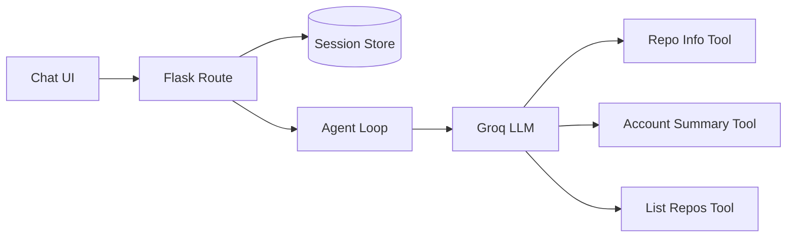

# GitSpy 

An AI agent that answers natural-language questions about GitHub accounts and repositories using LLM function-calling — built to learn how AI agents actually work under the hood.

## What it does

Ask GitSpy things like:
- "Give me a summary of a user's GitHub account"
- "How many stars does a repo have?"
- "List all repos for a user"
- "Any question but related to github only"

The LLM decides which GitHub API calls to make, executes them, and responds in natural language — with full conversation memory, so you can ask follow-up questions.

**Example conversation:**
```
You: Give me a summary of dhravya's GitHub account
🤖 GitSpy:
GitHub Profile: @Dhravya
Bio: "20. passionate dev who ships (a lot). 2x acquired founder."
Followers: 3,712
Public Repos: 97
Total Stars Across All Repos: 2,216
Top Repository: notty – 496 stars
Most-Used Language: Python
Account Created: 2020-04-19

You: what's their top repo?
🤖 GitSpy:
Top Repository for @Dhravya
Name: notty
Description: An open source, minimal AI powered note-taking app and powerful markdown editor.
Stars: 496
Open Issues: 5
Primary Language: TypeScript
```

## How it works

1. User asks a question in plain English
2. The LLM (via Groq) decides whether it needs a tool, and which one
3. Python executes the real GitHub API call
4. Results are fed back to the LLM
5. The LLM writes a natural-language answer using the real data

This loop (think → act → observe → respond) is the core pattern behind every AI agent, regardless of framework.

## Architecture

GitSpy is a conversational agent that answers questions about GitHub 
repos and accounts. It uses an LLM (Groq, gpt-oss-20b) with function-calling 
to decide which GitHub API calls to make, executes them, and loops until 
it has enough information to respond.



The user's question flows through Flask into the agent loop, which calls 
Groq's LLM. The LLM decides whether to answer directly or call one of the 
three GitHub tools — if it calls a tool, the result gets fed back into the 
loop so the model can reason over it (up to 5 rounds, to prevent infinite 
looping on ambiguous questions).

Conversation history is turn-based: only the final question/answer pair 
from each turn is persisted between turns, and session data itself is 
stored server-side (not in the browser cookie), so large answers — like 
listing 90+ repos for one account — never hit browser cookie size limits.

## Tech stack

- **Python** — core logic
- **Groq API** (`openai/gpt-oss-20b`) — LLM with function-calling/tool-use
- **GitHub REST API** — live repo/account data (authenticated, 5,000 requests/hour)
- **Flask** — web backend
- **Flask-Session** — server-side session storage for conversation memory
- **HTML/CSS** — chat interface frontend

## Tools implemented

| Tool | What it does |
|---|---|
| `get_repo_info` | Fetch stars, issues, language, and last update for a specific repo |
| `get_account_summary` | Aggregate stats across a user's account: total stars, top repo, most-used language |
| `list_user_repos` | List all public repos for a user, sorted by stars |

## Setup

1. Clone this repo:
```bash
   git clone https://github.com/Vrishali34/gitspy.git
   cd gitspy
```

2. Create a virtual environment and install dependencies:
```bash
   python3 -m venv venv
   source venv/bin/activate
   pip install -r requirements.txt
```

3. Create a `.env` file in the project root with the following variables:
```
GROQ_API_KEY=your_groq_api_key_here
GITHUB_TOKEN=your_github_personal_access_token_here
FLASK_SECRET_KEY=any_random_secret_string
```
   - Get a free Groq API key at [console.groq.com](https://console.groq.com)
   - Get a GitHub personal access token at [github.com/settings/tokens](https://github.com/settings/tokens) (no scopes required for public data; this raises the GitHub API rate limit from 60/hour to 5,000/hour)
   - `FLASK_SECRET_KEY` can be any random string — used to sign the session cookie

4. Run it in the terminal:
```bash
   python3 main.py
```

   Or run the web version:
```bash
   python3 app.py
```
   Then visit `http://127.0.0.1:5000`

## Screenshots


